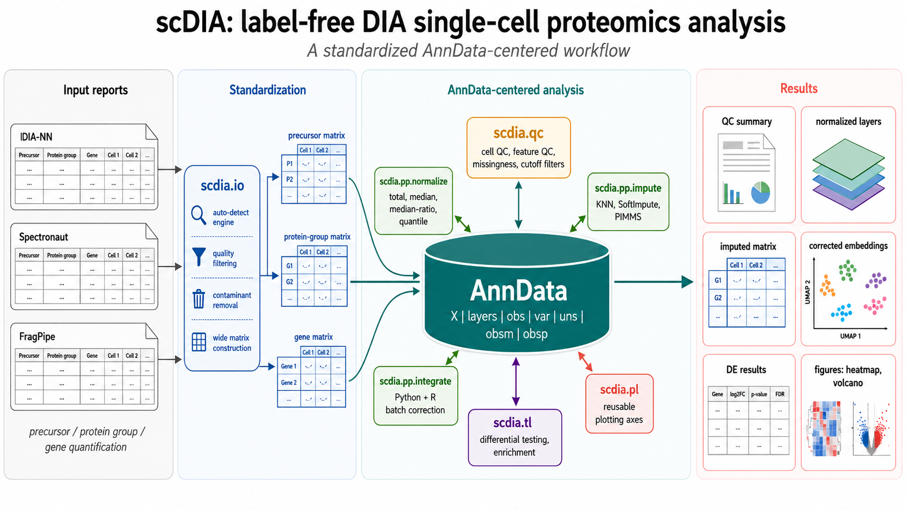

# scdia

`scdia` is a lightweight Python toolkit for label-free DIA single-cell
proteomics analysis. It uses `AnnData` as the main analysis container and
provides utilities for reading DIA search-engine reports, quality control,
normalization, imputation, batch correction, differential testing, volcano
plots, and enrichment analysis.



The package is organized into five public modules:


```python
import scdia as sd

sd.io  # report readers and matrix builders
sd.qc  # QC metrics (calculation only)
sd.pp  # preprocessing, imputation, and batch correction
sd.tl  # differential testing and enrichment
sd.pl  # plotting (QC, detection heatmap, volcano, ...)
```

All plotting functions live in ``sd.pl``. They accept an optional ``ax``
(or ``axes`` for multi-panel plots) and return the ``Axes`` (or a
``dict[str, Axes]``), never call ``plt.show()`` / ``fig.savefig()`` /
``tight_layout()``, so they compose cleanly into publication figures.

## Installation

Clone the public repository and install it in editable mode:

```bash
git clone https://github.com/SilverCopper/scDIA.git
cd scDIA
pip install -e .
```

Core dependencies are installed from `pyproject.toml`. Some workflows require
optional Python or R dependencies:

```bash
pip install -e ".[enrichment]"          # GSEApy/Enrichr
pip install -e ".[impute]"              # fancyimpute
pip install -e ".[pimms]"               # PIMMS deep-learning imputers
pip install -e ".[python-integration]"  # Harmony, Scanorama, BBKNN
pip install -e ".[scvi]"                # scVI models
pip install -e ".[all]"                 # all optional Python integrations
```

R-backed integration methods (`CCA`, `RPCA`, `FastMNN`, `Liger`) require an R
environment with `Seurat`, `SeuratWrappers`, `rliger`, `dplyr`, `anndataR`, and
`jsonlite`. The bundled `batch_correction.R` script is packaged with `scdia`.

## Quick Start

```python
import anndata as ad
import numpy as np
import scdia as sd

# Read a DIA-NN or Spectronaut report into a gene-level wide matrix.
gene_matrix = sd.io.read_gene_matrix(
    "report.tsv",
    engine="auto",
    quality_filter=True,
    drop_contaminate=True,
)

sample_cols = [
    col for col in gene_matrix.columns
    if col not in {"Genes", "ProteinGroups"}
]

adata = ad.AnnData(
    X=gene_matrix[sample_cols].T.to_numpy(dtype=float),
)
adata.obs_names = sample_cols
adata.var_names = gene_matrix["Genes"].astype(str)
adata.var["ProteinGroups"] = gene_matrix["ProteinGroups"].astype(str).to_numpy()

# Calculate QC metrics.
sd.qc.calculate_cell_qc_metrics(adata)
sd.qc.calculate_feature_qc_metrics(adata)

# Normalize linear intensities into a layer and log-transform for downstream use.
sd.pp.normalize_total(
    adata,
    output_layer="total_normalized",
    key_added="total_size_factor",
)
adata.layers["log2_total_normalized"] = np.log2(adata.layers["total_normalized"] + 1)
```

## Reading DIA Reports

`sd.io` supports three search engines, auto-detected from column names:

- **Spectronaut** — long-format report.tsv
- **DIA-NN** — long-format report.tsv
- **FragPipe** — wide-format `combined_protein.tsv` (pg / gene levels) and
  `combined_ion.tsv` (precursor level)

```python
precursor = sd.io.read_precursor_matrix("report.tsv", engine="auto")
protein_group = sd.io.read_pg_matrix("report.tsv", engine="auto")
gene = sd.io.read_gene_matrix("report.tsv", engine="auto")

# FragPipe combined_protein.tsv (default = MaxLFQ Intensity)
pg = sd.io.read_pg_matrix("combined_protein.tsv", engine="fragpipe")
pg_raw = sd.io.read_pg_matrix(
    "combined_protein.tsv", engine="fragpipe", quantity_mode="intensity"
)
```

Useful options:

- `quality_filter=True` applies engine-specific quality filters such as decoy
  removal or q-value filtering.
- `drop_contaminate=True` removes missing annotations and contaminant protein
  groups.
- `quantity_mode` selects an engine-specific intensity column, such as `ms1` or
  `ms2` where available.
- `split_multigene_rows()` can split multi-gene annotations after constructing a
  gene matrix.

## Quality Control

Cell-level and feature-level QC metrics are written to `adata.obs` and
`adata.var` when `inplace=True`.

```python
sd.qc.calculate_cell_qc_metrics(adata, layer=None)
sd.qc.calculate_feature_qc_metrics(adata, layer=None)
sd.qc.report_missing_values(adata, groupby="batch")
```

Plotting helpers live in ``sd.pl`` and return ``Axes`` (single panel) or a
``dict`` of ``Axes`` (multi-panel) so they compose freely into publication
figures:

```python
ax = sd.pl.plot_data_completeness(adata)
ax = sd.pl.plot_saturation_curve(adata)
axes = sd.pl.plot_detection_heatmap_by_batch(adata, batch_col="batch")
# axes["batch"], axes["heatmap"] are individually styleable
```

`calculate_qc_cutoffs()` estimates a minimum detected-feature cutoff and
intensity outlier bounds, and stores a pass/fail column in `adata.obs`. The
returned dictionary also exposes the slope-search state used by the two
companion plots in ``sd.pl``:

```python
cutoffs = sd.qc.calculate_qc_cutoffs(adata)
sd.pl.plot_qc_cutoff_search(cutoffs)
sd.pl.plot_qc_filter_comparison(adata, cutoffs)
```

## Preprocessing

`sd.pp.normalize()` dispatches to several normalization methods:

```python
sd.pp.normalize(adata, method="total", output_layer="total_normalized")
sd.pp.normalize(adata, method="median", output_layer="median_normalized")
sd.pp.normalize(adata, method="median_ratio", output_layer="median_ratio")
sd.pp.normalize(adata, method="quantile", output_layer="quantile_normalized")
```

Normalization functions expect non-negative linear intensities. By default,
zeros and non-finite values are treated as missing values.

Imputation uses `fancyimpute`:

```python
sd.pp.impute(
    adata,
    method="KNN",
    layer="total_normalized",
    output_layer="imputed",
)
```

PIMMS deep-learning imputers are also available when `pimms-learn` is
installed:

```python
sd.pp.impute(
    adata,
    method="PIMMS_DAE",  # or "PIMMS_VAE", "PIMMS_CF"
    layer="total_normalized",
    output_layer="pimms_dae",
    epochs_max=100,
    latent_dim=15,
    cuda=False,
)
```

## Batch Correction

`preprocess_for_integration()` prepares normalized data, optional highly
variable features, PCA, and neighbors:

```python
sd.pp.preprocess_for_integration(
    adata,
    batch_key="batch",
    raw_layer=None,
    normalized_layer="log2_total_normalized",
    n_pcs=20,
)
```

`integrate()` can run Python-backed and R-backed integration methods:

```python
corrected = sd.pp.integrate(
    adata,
    batch_key="batch",
    methods=["Combat", "Harmony", "Scanorama", "BBKNN"],
    normalized_layer="log2_total_normalized",
    inplace=False,
)
```

Outputs are stored in standard AnnData slots:

- embeddings: `adata.obsm["Combat"]`, `adata.obsm["Harmony"]`,
  `adata.obsm["Scanorama"]`, `adata.obsm["scVI_normal"]`, etc.
- BBKNN graph: `adata.uns["bbknn"]`,
  `adata.obsp["bbknn_connectivities"]`, and
  `adata.obsp["bbknn_distances"]`.
- Scanpy preprocessing may also populate standard keys such as
  `adata.uns["pca"]` and `adata.uns["neighbors"]`.

`scdia` no longer writes custom preprocessing history records into
`adata.uns`, which keeps exported `.h5ad` files more compatible with older
`anndata` readers.

## Differential Testing

`sd.tl.de_test()` performs two-group differential testing and stores the result
under `adata.uns[key_added]`.

```python
sd.tl.de_test(
    adata,
    groupby="condition",
    group1="disease",
    group2="control",
    layer="log2_total_normalized",
    test="mannwhitneyu",
    key_added="de_disease_vs_control",
)

results = adata.uns["de_disease_vs_control"]["results"]
```

Supported tests:

- `mannwhitneyu`
- `wilcoxon`
- `welch`
- `student`

The result table includes `gene`, `pval`, `pval_adj`, `log2foldchange`,
`size1`, `size2`, `pct1`, and `pct2`.

Volcano plot:

```python
ax = sd.pl.plot_de_volcano(
    adata,
    de_key="de_disease_vs_control",
    n_top=15,
    genes_of_interest=["APOE", "TREM2"],
)
```

## Enrichment Analysis

`sd.tl.enrich_de_genes()` connects DE results to GSEApy/Enrichr
over-representation analysis.

```python
enrichment = sd.tl.enrich_de_genes(
    adata,
    de_key="de_disease_vs_control",
    direction="up",
    gene_sets=["MSigDB_Hallmark_2020", "GO_Biological_Process_2023"],
    organism="Mouse",
    log2foldchange_cutoff=0.5,
    pvalue_cutoff=0.05,
)
```

The returned table is also stored in:

```python
adata.uns["de_disease_vs_control_up_enrichr"]["results"]
```

Use `sd.tl.get_gseapy_libraries(organism="Mouse")` to list available Enrichr
libraries.

## Package Layout

```text
scdia/
  pyproject.toml       package metadata and dependencies
  README.md            package documentation
  src/
    scdia/
      __init__.py      package entry point
      io.py            DIA report readers and matrix construction
      qc.py            QC metric calculations
      pp/              preprocessing, imputation, and batch correction
        normalize.py   normalization methods
        impute.py      imputation
        integration.py one-step preprocessing and batch correction
        batch_correction.R
                      R-backed batch correction bridge
      tl.py            differential testing and enrichment
      pl.py            plotting (publication-ready)
```

## Compatibility Notes

- The package is designed around `AnnData` and follows Scanpy-style slot usage.
- Optional integrations should be installed only when needed; they can be heavy
  and may require separate Python or R environments.
